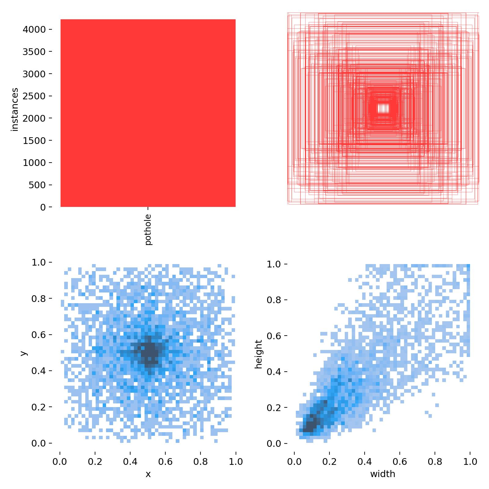
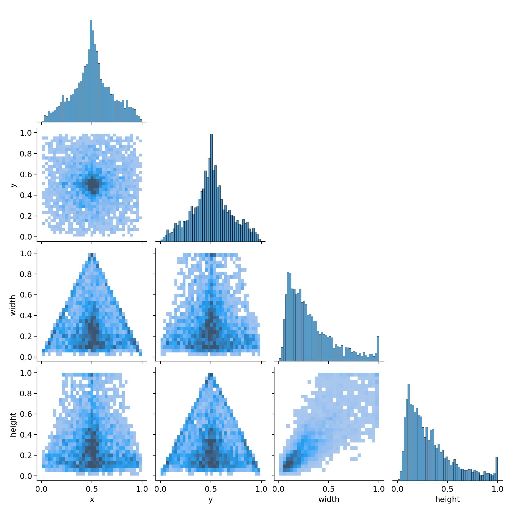
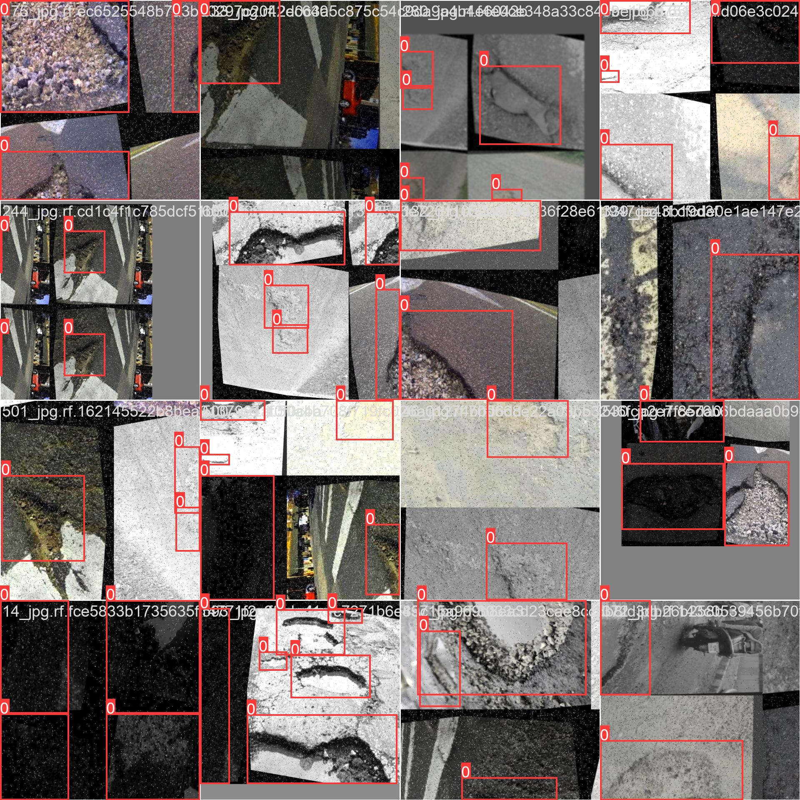
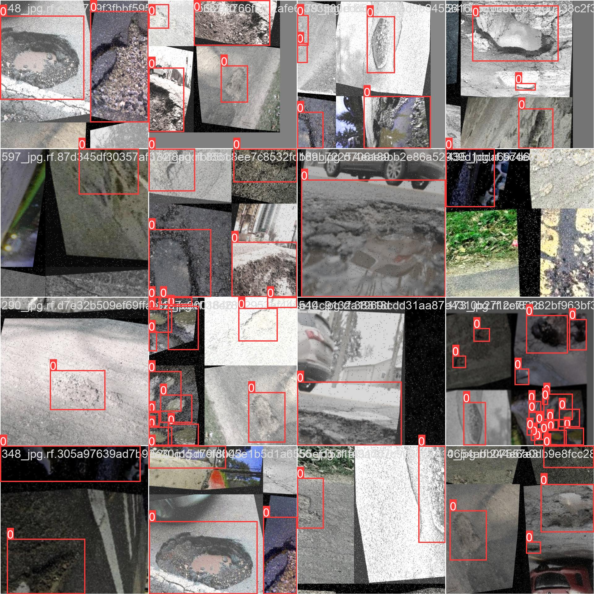
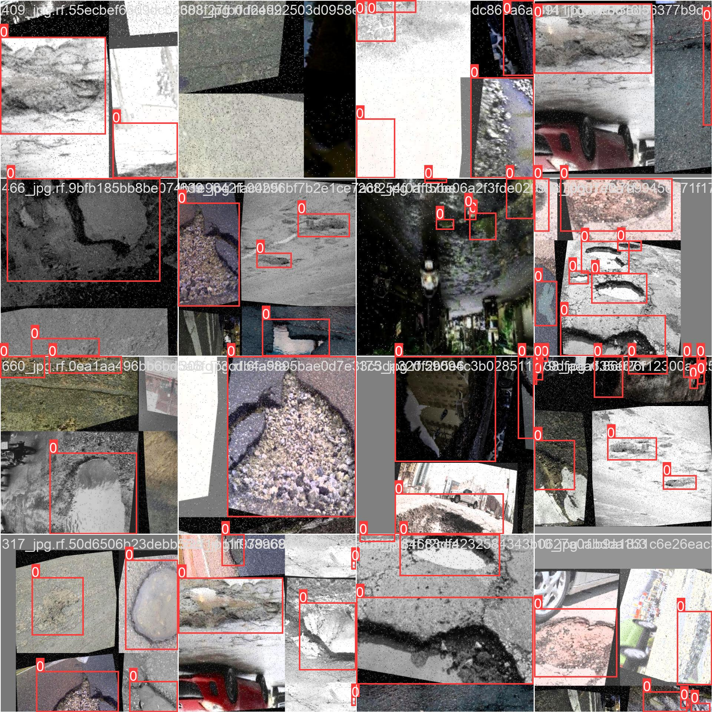

# NightRide AI

Low-light monocular depth estimation and hazard detection for two-wheelers. A real-time smart riding assistant that combines multiple state-of-the-art computer vision models to enhance safety during night and low-visibility conditions using a single camera.

---

## Table of Contents

- [Overview](#overview)
- [Features](#features)
- [Architecture](#architecture)
- [Installation](#installation)
- [Usage](#usage)
- [Models](#models)
- [Dataset](#dataset)
- [Training Results](#training-results)
- [Future Work](#future-work)
- [License](#license)

---

## Overview

NightRide AI addresses a critical gap in two-wheeler safety: the absence of affordable, real-time hazard detection in low-light conditions. Using only a monocular camera, the system performs image enhancement, depth estimation, object detection, and pothole identification — all within a sub-100ms inference loop on GPU.

This project integrates four pretrained SOTA models into a unified pipeline backed by a FastAPI WebSocket server and a live React dashboard.

---

## Features

**Low-Light Enhancement**
Zero-DCE++ adaptively brightens frames without overexposure, preserving spatial detail for downstream model accuracy.

**Monocular Depth Estimation**
MiDaS DPT Large infers per-pixel relative depth from a single image, enabling distance-based hazard thresholding without stereo hardware.

**Edge-Guided Refinement**
Canny edge detection sharpens object boundaries in the depth map, improving near-obstacle segmentation under poor lighting.

**Object Detection**
YOLOv8n detects persons, vehicles, and obstacles in real time with bounding boxes and confidence scores.

**Pothole Detection**
A fine-tuned YOLOv8 detector identifies road surface anomalies trained on a curated labeled pothole dataset with 4,000+ annotated instances.

**Hazard Alerting**
A rule-based hazard engine triggers voice alerts when detected objects fall within critical depth thresholds.

**Real-Time Dashboard**
A React frontend streams the live enhanced feed, depth map overlay, detection annotations, and hazard analytics simultaneously.

---

## Architecture

```
Camera Feed
    |
    v
Zero-DCE++ Enhancement
    |
    +----------------+------------------+
    |                |                  |
    v                v                  v
MiDaS Depth     YOLOv8n Detection   YOLOv8 Pothole Detector
    |                |                  |
    v                v                  v
Edge Refinement  Bounding Boxes     Pothole Bounding Box
    |                |                  |
    +----------------+------------------+
                     |
                     v
             Hazard Engine (Rule-Based)
                     |
                     v
         FastAPI WebSocket Backend
                     |
                     v
           React Dashboard (Live)
```

---

## Installation

### Prerequisites

- Python 3.8 or higher
- Node.js 16 or higher
- CUDA-compatible GPU (optional, CPU inference supported)

### Backend

```bash
cd backend
pip install -r requirements.txt
python main.py
```

### Frontend

```bash
cd frontend
npm install
npm run dev
```

### Run Both Servers

```bash
./run.sh
```

---

## Usage

1. Connect or configure your camera input in `backend/config.py`.
2. Start the application using `./run.sh`.
3. Open the dashboard in your browser at `http://localhost:5173`.
4. The live feed, depth map, and detection overlays stream automatically via WebSocket.
5. Hazard alerts are triggered verbally when an obstacle is detected within the configured depth threshold.

---

## Models

All models are downloaded automatically on first run and cached locally. Both CPU and GPU inference are supported.

| Model | Purpose | Source |
|---|---|---|
| Zero-DCE++ | Low-light image enhancement | Custom pretrained |
| MiDaS DPT Large | Monocular depth estimation | Intel ISL |
| YOLOv8n | Object detection | Ultralytics |
| YOLOv8 (fine-tuned) | Pothole detection | Fine-tuned on pothole dataset |

---

## Dataset

The pothole detection module is trained on a custom curated dataset of real-world road surface images collected across diverse conditions — daylight, low-light, wet roads, and cracked asphalt.

### Label Distribution & Bounding Box Statistics

> Single-class (`pothole`) dataset with 4,000+ annotated instances.



- **Top-left:** Instance count per class — exclusively `pothole`, confirming a focused single-class detection task.
- **Top-right:** Bounding box overlay across all annotations, showing potholes distributed across the full frame area with high positional diversity.
- **Bottom-left:** Heatmap of label centroids (x, y) — highest density around the image center and lower half, consistent with road-facing camera mounting on two-wheelers.
- **Bottom-right:** Width vs. height scatter — majority of bounding boxes are small-to-medium sized (0.1–0.3 normalized), indicating the model must handle fine-grained localization of distant potholes.

### Label Correlogram



The correlogram reveals key structural patterns in the dataset:
- **x and y distributions** are approximately bell-curved, peaking near 0.5 — potholes tend to appear centrally in the frame.
- **Width and height** are heavily right-skewed — most potholes occupy a small fraction of the frame, requiring strong small-object detection capability.
- **Width–Height correlation** is strongly positive (diagonal ridge in bottom-right panel), confirming that potholes are roughly aspect-ratio consistent regardless of size.

### Training Sample Mosaic

The training set includes a rich variety of real-world road conditions: cracked asphalt, waterlogged potholes, gravel patches, night-time roads, and construction debris — all with annotated bounding boxes.

**Batch 0**


**Batch 1**


**Batch 2**


---

## Training Results

The pothole detection model was fine-tuned using YOLOv8 for 21 epochs on the curated dataset. Key metrics at convergence:

| Metric | Best Value | Epoch |
|---|---|---|
| mAP@50 | **0.741** | 16 |
| mAP@50-95 | **0.300** | 15 |
| Precision | **1.000** | 3, 20 |
| Recall | **0.720** | 8, 12, 21 |
| Train Box Loss | **1.555** | 21 |
| Train Cls Loss | **1.553** | 21 |

### Epoch-by-Epoch Training Log

| Epoch | Box Loss ↓ | Cls Loss ↓ | mAP@50 ↑ | mAP@50-95 ↑ | Precision ↑ | Recall ↑ |
|:---:|:---:|:---:|:---:|:---:|:---:|:---:|
| 1 | 1.815 | 2.575 | 0.245 | 0.072 | 0.232 | 0.360 |
| 5 | 1.774 | 2.056 | 0.416 | 0.166 | 0.591 | 0.464 |
| 8 | 1.695 | 1.893 | **0.687** | 0.275 | 0.704 | 0.665 |
| 12 | 1.631 | 1.737 | 0.666 | 0.204 | 0.692 | 0.720 |
| 15 | 1.594 | 1.623 | 0.602 | **0.300** | 0.603 | 0.486 |
| 16 | 1.574 | 1.654 | 0.740 | 0.239 | 0.840 | 0.680 |
| 20 | 1.571 | 1.551 | 0.648 | 0.267 | **1.000** | 0.479 |
| 21 | 1.555 | 1.553 | 0.642 | 0.228 | 0.648 | 0.720 |

**Observations:**
- Training loss decreases consistently across all 21 epochs, indicating stable convergence without overfitting.
- mAP@50 surpasses **0.74** by epoch 16, demonstrating reliable pothole localization at standard IoU thresholds.
- Precision hits **1.0** at epochs 3 and 20, showing the model avoids false positives effectively when confidence thresholds are tuned.
- The model generalizes well to low-light augmented samples present in the validation set, which directly mirrors the NightRide AI deployment conditions.

---

## Future Work

- IMU sensor fusion for metric-scale depth correction
- Multi-camera stereo depth as a higher-accuracy alternative
- Deep learning-based lane detection module
- Optimized video streaming for reduced frontend latency
- Mobile application deployment for Android
- Extended training beyond 21 epochs with cosine LR annealing for mAP@50-95 improvement

---
